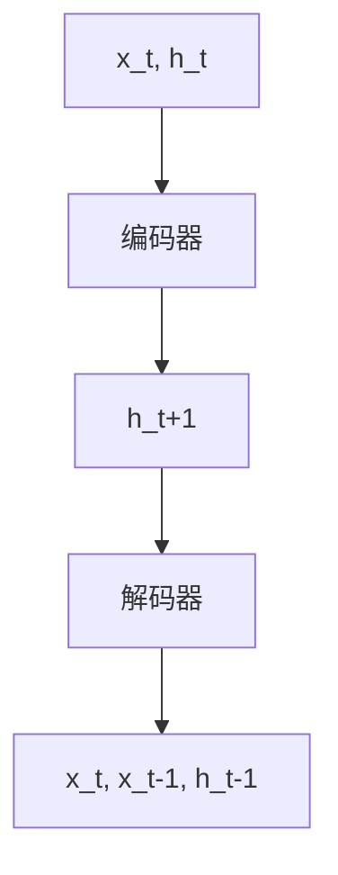

# Stable RNN 架构 （还在开发）
这是一个改进 RNN 架构的实验项目，核心思想是将「记忆」与「输出」两个阶段解耦，实现更稳定、更可控的训练过程。

使用自编码让模型学会记忆当前时间步输入和上时间步的记忆

```mermaid
graph TD
    A[x_t, h_t] --> B[编码器]
    B --> C[h_t+1]
    C --> D[解码器]
    D -->E[x_t, x_t-1, h_t-1]
```