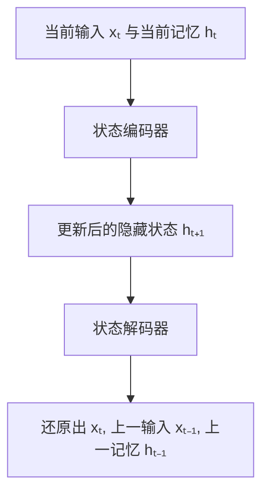

# Stable RNN 架构 （还在开发）
这是一个正在开发中的 改进型 RNN 架构，核心思想是将 “记忆” 与 “输出” 两个阶段解耦，通过自编码机制实现更加稳定且易于控制的训练流程。

✨ 模型设计理念
* 使用 自编码机制 强化模型的记忆能力，让模型在每个时间步学会重建「当前输入」和「历史记忆」。

* 解耦传统 RNN 的隐状态更新与预测输出，降低梯度跨时间传播的路径长度，从而缓解梯度爆炸与消失问题。

* 隐藏状态 h_t 可设计为离散表示

使用自编码让模型学会记忆当前时间步输入和上时间步的记忆

解码目标
通过重构出：

* 当前时间步输入 xₜ

* 上一个时间步输入 xₜ₋₁

* 上一时间步隐藏状态 hₜ₋₁

模型被鼓励主动记住关键时序信息，而不是被动依赖长链梯度传播。